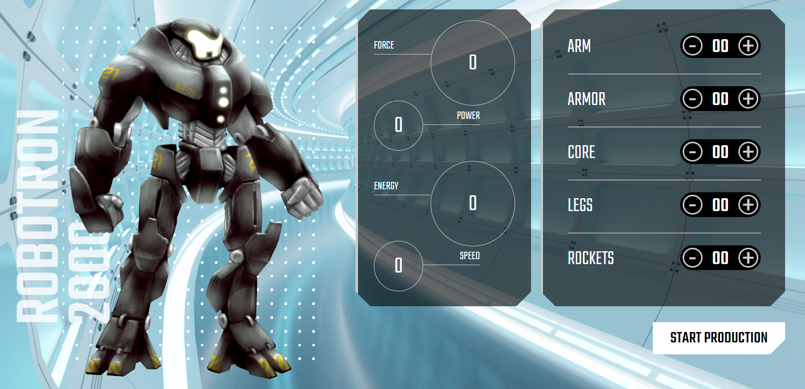

<h1 align="center">🤖 Robotron-2000 🤖</h1>

DOM Study Project.

This project was made following the design of Alura's DOM study, you can see the challenge by <a href="https://cursos.alura.com.br/course/javascript-manipulando-dom">clicking here.</a>

<h2>⚙️Tecnologias</h2>

<h2>❔ How to Use </h2>

Before cloning the repository into your machine you'll need <a href="https://git-scm.com/">Git</a>. Also it is good to have a code editor like <a href="https://code.visualstudio.com/">VSCode.</a>

<h2>🗣 Author </h2>

Made with ❤️ by Gustavo Barboza

   
   

